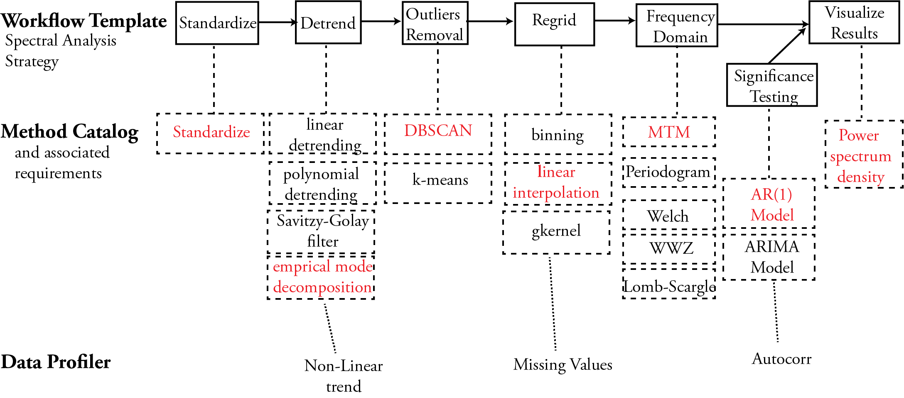

.. _philosophy:

The philosophy behind PaleoTS
=============================

What is PaleoTS?
^^^^^^^^^^^^^^^^

PaleoTS represents a specific paleoclimate application of the `autoTS <https://knowledgecaptureanddiscovery.github.io/autoTS/>`_, an automated system for time series analysis. autoTS is conceived around three ideas:

* To capture expert knowledge as semantic workflow templates that represent common multi-step analysis strategies and constraints.
* To automatically characterize datasets to extract properties that will affect the choice of analytic methods (e.g., the data has missing values) to instantiate those workflow templates.
* To curate a catalog of primitive pre-processing and analysis functions for timeseries data that map to workflow steps and are annotated with preconditions (e.g., evenly-spaced time series is requires), performance (e.g., bias in the low-frequency domain), and other constraints that will be used to generate solutions.

Why PaleoTS?
^^^^^^^^^^^^

Time series analysis can be useful to (1) identify periodicities, which may be associated with known phenomena; (2) investigate the temporal continuum to understand how energy within the Earth system is redistributes across various timescales;(3) assign time to the long geologic record of past climate varaibility; (4) filter to highlight specific features in climate datasets; (5) detect regime shift; (6) identify coherent spatiotemporal variability betweenn multiple independent series; (6) identify correlation between climate variables.

Although many signal processing methodologies relevant to time series analysis are widely available in popular packages and libraries in Matlab, R, and Python, there are important aspects that should be taken into consideration as are often unique to the dataset(s) of interest:

* Identifying methods and set parameters that are appropriate for a given dataset. For instance, most paleoclimate studies rely on datasets that are often unevenly-spaced in time. An analyst is then left with too choices: use a method appropriate for such datasets (e.g., the Lomb-Scargle Fourier Transform and the Weighted Wavelet Z-Transform) or regrid the data to use a more traditional method (such as the multi-taper method). Both approaches have tradeoffs that should be caefully evaluated for each problem.
* Preparing data for analysis. In addition to the regridding problem mentioned above, time series are often pre-processed before analysis, including standardization and detrending. Although detrending allows highlighting high-frequency periodicities that may be of interest to the researcher and to remove spurious changes, the removal of a long-term trend can mask important, deterministic signals that may provide important clues about the behavior of the climate system.
* Specifying the null hypothesis. To evaluate the significance of spectral peaks in a climate time series, a researcher needs to generate a null hypothesis.

Consequently, time series analysis is often considered more of an art than a science, and a researcher may want to generate all possible solutions for their dataset to evaluate the robustness of their conclusions. This would be a duanting tasks if performed manually.

PaleoTS aims to help with this process by generating strategies for analysis and executing all possible solutions based on this strategy.

How does it work?
^^^^^^^^^^^^^^^^^

The technical details are described in the following section but for now, think about how you would describe performing a statistical analysis at a high-level. Let's use the example of spectral analysis. Essentially, it consists of pre-processing steps such as standardization, detrending and regridding, the analysis step (transformation from the time to the frequency domain), and assessment of significance. The strategy described here can be encasulated in an **abstract template** as shown in the figure below.

This template can then be filled with various methods. For instance, detrending can be accomplished through linear detrending or a Savitzy-Golay filter and spectral analysis can be performed through a variety of methods. The model catalog keeps track of the methof and their associated requirements in the form of rules. For instance, MTM requires evenly-spaced data and linear detrending is only appopriate if the trend is linear. Each method has an implementation. As of September 2022, PaleoTs only uses methods available through the `Pyleoclim <https://pyleoclim-util.readthedocs.io/en/master/>`_ software package, which was developed in parallel. Please note that Pyleoclim is **not** necessary for PaleoTS and methods from other packages can be used as long as they meet specific criteria which are detailed in :ref:`working`.

In order for the rules to apply a data profiler allows to 'sense' the data. As of September 2022, we have two main sensors:

* Whether the data is evenly-spaced (see `this Pyleoclim method <https://pyleoclim-util.readthedocs.io/en/master/core/api.html#pyleoclim.core.series.Series.is_evenly_spaced>`_)
* Whether the data contains a trend using the Mann-Kendall test from `this package <https://pypi.org/project/pymannkendall/>`_. We use the Hamed and Rao modified version of this test to address serial autocorrelation issues. If a trend is detected, a series of polynomials is then fitted to the data to determine whether the trend is linear. The determination is made by calculating the RMSE for each fit and identifiying the elbow for "best fit". The method and its performance is described in a series of `Jupyter Notebooks <https://github.com/KnowledgeCaptureAndDiscovery/autoTS/tree/master/notebooks/Methods/Detrending>`_.

Based on the information about the method and the data, PaleoTS then chooses appropriate methods and steps for the data. For instance, if the data is evenly-spaced or the method doesn't require evenly-spaced data (e.g., Lomb-Scargle), then PaleoTS will skip the regridding step. Similarly, if the profiler detects a nonlinear trend, the linear detrending method will not be applied.

Technical details
^^^^^^^^^^^^^^^^^

PaleoTS is built on the WINGS workflow system, which has been extended to include data profiler. WINGS is a semantic workflow system that assists scientists with the design of computational experiments. A unique feature of WINGS is that its workflow representations incorporate semantic constraints about datasets and workflow components, and are used to create and validate workflows and to generate metadata for new data products. Information about WINGS can be found `here <https://www.wings-workflows.org>`_.
